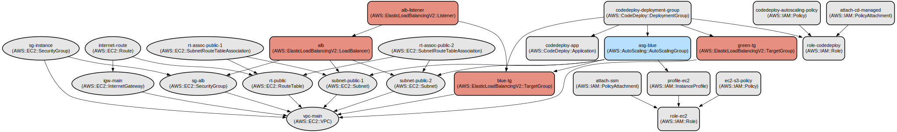

# AWS Blue-Green Deployment Infrastructure as Code with CDKTF

This project provides an infrastructure as code solution for implementing Blue-Green deployments on AWS using the Cloud Development Kit for Terraform (CDKTF). It creates a complete deployment environment with automated scaling, load balancing, and zero-downtime deployment capabilities.

The infrastructure includes a fully configured VPC with public subnets, an Application Load Balancer (ALB), Auto Scaling Groups for managing EC2 instances, and AWS CodeDeploy for orchestrating Blue-Green deployments. This setup enables reliable and automated application deployments with minimal downtime and automatic rollback capabilities.

## Repository Structure
```
.
├── cdktf.json              # CDKTF configuration file defining providers and project settings
├── main.py                 # Core infrastructure definition with AWS resource configurations
├── main-test.py           # Test suite for infrastructure validation
├── Pipfile.lock           # Python dependency lock file ensuring consistent environments
└── .gitignore             # Git ignore patterns for build artifacts and local files
```

## Usage Instructions
### Prerequisites
- Python 3.8 or higher
- pip and pipenv for Python package management
- AWS CLI configured with appropriate credentials
- Terraform CLI (version compatible with AWS provider ~> 5.0)
- Node.js (required for CDKTF)

### Installation

1. Clone the repository:
```bash
git clone <repository-url>
cd <repository-directory>
```

2. Install dependencies:
```bash
pipenv install
```

3. Initialize CDKTF:
```bash
cdktf init
```

### Quick Start

1. Configure AWS credentials:
```bash
aws configure
```

2. Synthesize and deploy the infrastructure:
```bash
cdktf synth
cdktf deploy
```

### More Detailed Examples

1. Customizing the VPC Configuration:
```python
# In main.py, modify the configuration constants
VPC_CIDR = "10.0.0.0/16"
AVAILABILITY_ZONES = ["ap-south-1a", "ap-south-1b"]
```

2. Modifying Auto Scaling Group settings:
```python
# In main.py, adjust the ASG configuration
AutoscalingGroup(self, "asg-blue",
    min_size = 1,
    max_size = 3,
    desired_capacity = 2
)
```

### Troubleshooting

1. CDKTF Synthesis Issues
- Problem: `cdktf synth` fails
- Solution: 
  ```bash
  # Clear CDKTF cache
  rm -rf cdktf.out/
  cdktf synth
  ```

2. AWS Provider Authentication
- Problem: AWS provider authentication errors
- Solution: Verify AWS credentials:
  ```bash
  aws sts get-caller-identity
  ```

3. Deployment Failures
- Problem: Stack deployment fails
- Solution: Check CloudWatch logs and enable debug mode:
  ```bash
  export TF_LOG=DEBUG
  cdktf deploy
  ```

## Data Flow
The infrastructure enables a Blue-Green deployment workflow with the following data flow:

```ascii
[CodeDeploy] --> [ALB] --> [Blue ASG]
                     \--> [Green ASG]
                          (during deployment)
```

Component interactions:
1. CodeDeploy initiates deployment to the Green environment
2. ALB health checks verify new deployment
3. Traffic gradually shifts from Blue to Green
4. Blue environment remains available for rollback
5. Upon successful deployment, Blue environment is terminated

## Infrastructure



### VPC Resources
- VPC (`10.0.0.0/16`)
- Public Subnets in multiple AZs
- Internet Gateway
- Route Tables

### Security
- ALB Security Group (Inbound: 80)
- Instance Security Group (Inbound: 80 from ALB)
- IAM Roles for CodeDeploy and EC2

### Compute
- Application Load Balancer
- Auto Scaling Groups
- Launch Templates
- Target Groups (Blue/Green)

### Deployment
- CodeDeploy Application
- CodeDeploy Deployment Group
- S3 Bucket for artifacts